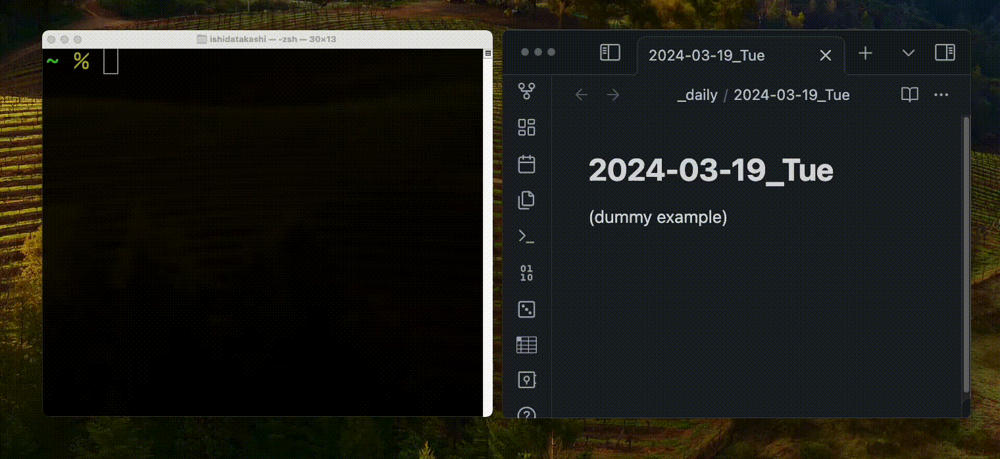

# RapidAdd

RapidAdd is a simple command-line tool for quickly adding notes and logging daily activities directly into a daily plain text file (like md or txt), without leaving your terminal. It aims to eliminate the inconvenience of switching to or opening note-taking apps (such as Obsidian) just to jot down a quick note. This approach helps maintain focus by avoiding unintentional distractions from other applications or from previously written tasks and notes in your daily log. If you like keeping things straightforward and prefer using the terminal for as much as possible, RapidAdd could be a handy addition to your toolkit.



### Installation

To use RapidAdd, you need to have Rust and Cargo installed on your machine. If you don't have Rust installed, you can install it by following the instructions at [https://www.rust-lang.org/tools/install](https://www.rust-lang.org/tools/install).

Go through the following steps to use the tool:

1. Clone the repository:
   ```
   git clone https://github.com/takashiishida/rapidadd.git
   ```
2. Navigate to the project directory:
   ```
   cd rapidadd
   ```
3. Build the project using Cargo:
   ```
   cargo build --release
   ```
4. The compiled binary will be located in `target/release`. You can copy it to a directory in your PATH for easier access. For example:
   ```
   cp target/release/rapidadd ~/.local/bin/rapidadd
   ```

### Configuration

Before using RapidAdd, you need to create a configuration file at `~/.config/rapidadd/config.toml`. Here's an example configuration:

```toml
daily_path = "/path/to/your/daily/logs"
file_extension = "md"
date_format = "%Y-%m-%d_%a"
```

- `daily_path`: The directory where your daily log files will be stored.
- `file_extension`: The file extension for your log files (e.g., "md" for Markdown, "txt" for plain text).
- `date_format`: The format used to name your daily log files, following the strftime format.

### Usage

To add an entry (e.g. "your text goes here") to your daily log, simply run:

```
rapidadd your text goes here
```

This will append your entry, prefixed with the current time, to a log file named with the current date in your specified `daily_path`. For example, if the time is 18:56, the end of your daily file will have the additional line:

```
- 18:56 your text goes here
```

If your text contains special characters such as `?` and `'`, make sure to quote your argument or escape them with backslashes. On the other hand, we do not need to escape space characters as we saw in the example above.

You can also print the daily log file:

```
rapidadd -p
```

### Additional information

- Acknowledgement: Inspired by the [QuickAdd](https://github.com/chhoumann/quickadd) plugin for Obsidian. RapidAdd is basically just a simplified version of the *capture* functionality in QuickAdd but with the CLI.
- Environment: This project was developed and tested only on macOS.
- Feedback and contributions: If you encounter any bugs or issues or have suggestions, feel free to reach out.